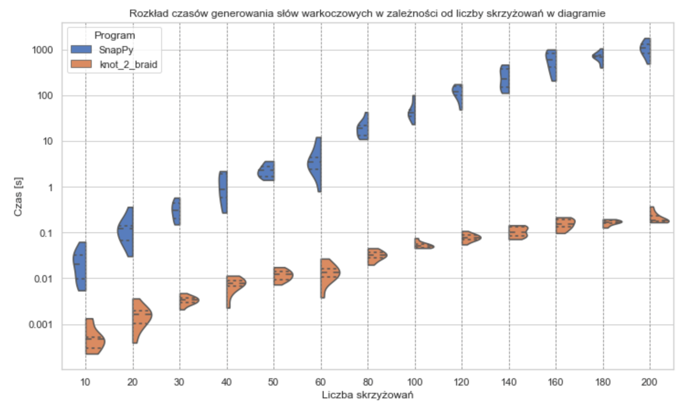

# knot-2-braid


_C++ implementation for converting **knot diagrams** into **braid representations**, developed as part of my Master's thesis._


> **Note:** Repository cleanup in progress. Usage may change.
<!-- (docs, comments, structure). -->

<br>

## Results



The figure compares the braiding runtime of **knot-2-braid** with **SnapPy** *(3.0.1)*.  
- **x-axis:** number of crossings in the input knot diagram (n)  
- **y-axis:** computation time (seconds, log scale)  
- Each violin plot shows the distribution of runtimes for 100 random knot diagrams with the same number of crossings.<!-- - Wider areas indicate higher variability in runtimes. -->
- SnapPy, the fastest of the tested existing implementations (**KnotTheory** for Mathematica, **Knot Theory** for SageMath, and SnapPy), was chosen for comparison; **knot-2-braid** consistently outperformed it in runtime.


---
## Running

### Build:

```bash
cd program
make # optional: make clean
```

### Run:

```
./bin/main <knot_pd_file>
```

**Example:**<br>
`./bin/main ../pd_data/pds_small_test/k_4.txt`


--- 
## Project structure

```
knot-2-braid
├── program 
│   ├── src # main program code
│   │   ├── main.cpp   
│   │   ├── building_blocks/ # graph components classes
│   │   └── parser/ # PD-code parser
│   ├── Makefile 
│   ├── bin/ 
│   ├── obj/
│   ├── pd_data/ # example PD-codes
│   ├── time_tests/
│   └── tests/
├── README.md 
├── figures
└── knot-2-braid.pdf
```


## Citation
If you use this code, please cite: 

```
@mastersthesis{sudol2025knot2braid,
  title={From knots to braids. Practical implementation of proposed algorithm.},
  author={M. Sudoł},
  school={University of Warsaw},
  year={2023},
  note= {Master's Thesis}
}
```
